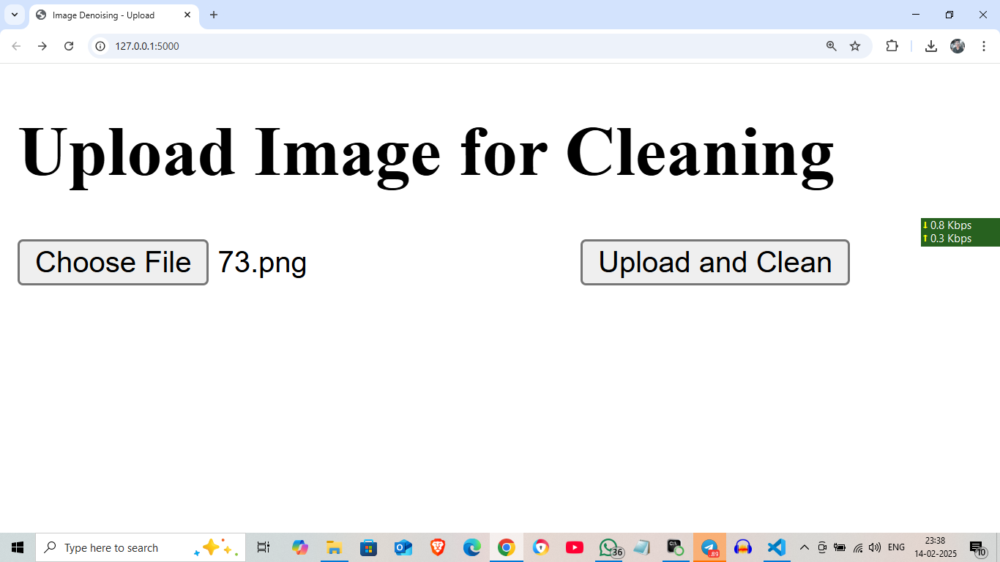

# 🚗 Car Speed Detection Using YOLOv5 🏎️💨  

## 📌 Project Overview  
This project uses **YOLOv5** to detect vehicles and estimate their speed from a video feed. The detected speed is displayed in **bold yellow text**, making it easier to read. The processed video is saved for further analysis.  

## ✨ Features  
✅ **Real-time Object Detection** – Detects cars, buses, trucks, and motorcycles 🚘🚌🚛🏍️  
✅ **Speed Estimation** – Calculates speed using pixel distance and time ⏳📏  
✅ **Bold Yellow Speed Display** – Enhanced visibility for speed overlay 📢🟡  
✅ **Video Output Storage** – Saves the processed video with detections 🎥💾  

## 🛠️ Installation  
Make sure you have Python installed, then install dependencies:  

```bash
pip install torch torchvision opencv-python numpy
```

## 🚀 Run the Script  
Simply execute:  

```bash
python main.py
```

> 🎥 **Make sure to update the path to your input video inside the script!**  

## 🖼️ Sample Output  
The output video will display:  
🔹 **Detected vehicles** with a **yellow bounding box**  
🔹 **Speed overlay** in **bold yellow text**  
🔹 **Tracking of vehicles over time**  

## 📂 File Structure  
```
📁 Car_Speed_Detection_Using_YOLOv5
 ├── main.py  # The main script
 ├── detected_video.mp4  # Processed output video
 ├── README.md  # Project documentation
 ├── requirements.txt  # List of dependencies
```

## 📝 Notes  
-with enough data if it can train then that perform better on all image
- Adjust the `scale` variable for better speed estimation 🎯  
- The script tracks vehicles based on their movement over frames 🚥  
- Press **'Q'** to exit the video display window manually ❌  

## 🤝 Contribution  
Feel free to **fork** and improve the project! PRs are welcome. 🙌  

